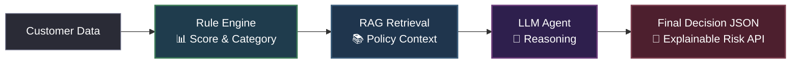

# ⚡ AI Risk Intelligence Platform (Credit Risk Engine)

### *FastAPI + LLM + RAG for Real-Time Financial Risk Assessment*

---

<p align="center">
  
  
  
  
</p>

---

## 🌟 Introduction

The **AI Risk Intelligence Platform** is a production-ready, high-performance financial risk evaluation engine. It simulates modern fintech underwriting operations by combining **rigid, rule-based scoring engines** with the **reasoning power of Large Language Models (LLMs)** and context-aware **Retrieval-Augmented Generation (RAG)**.

This hybrid approach ensures decisions are:
* **Deterministic:** Base scores are calculated using mathematical credit rules.
* **Explainable:** Natural-language justifications describe *why* an applicant is high/medium/low risk.
* **Contextual:** Underwriting guidelines are dynamically retrieved from external policies.

---

## 🧠 System Architecture

This engine pipelines inputs through a modular, multi-tier intelligence stack:



---

## ✨ Features

- 🧮 **Deterministic Rule Engine:** Computes risk scores and categories based on Debt-To-Income (DTI), credit scores, existing liabilities, and payment histories.
- 📚 **Policy-Aware RAG:** Reads underwriting policies dynamically from `data/policies.txt` to inject compliance boundaries into the AI decision context.
- 🧠 **Explainable AI (XAI):** Employs GPT-4o-Mini to generate comprehensive, human-readable risk summaries and underwriter suggestions.
- 🛡️ **Graceful Fallback System:** Fully operational offline. Automatically degrades to rich rule-based descriptions if the LLM API is unavailable.
- ⚡ **High-Performance Backend:** Powered by FastAPI with robust Pydantic data validation and structured API responses.

---

## 🛠️ Tech Stack & Dependencies

| Layer | Component | Description |
|---|---|---|
| **API Framework** | [FastAPI](https://fastapi.tiangolo.com) | Modern, fast web framework for building APIs. |
| **Validation** | [Pydantic v2](https://docs.pydantic.dev) | Standard-setting data validation and settings management. |
| **Server** | [Uvicorn](https://www.uvicorn.org) | High-performance ASGI web server. |
| **AI Client** | [OpenAI SDK](https://github.com/openai/openai-python) | Official client libraries for LLM reasoning. |
| **Environment** | [Python Dotenv](https://github.com/theofidry/django-dotenv) | Clean, secure management of environment credentials. |

---

## 📂 Repository Layout

```
credit-risk-engine/
├── data/
│   └── policies.txt         # Risk compliance/underwriting policies
├── models/
│   └── schema.py            # Pydantic data validation schemas
├── services/
│   ├── rule_engine.py       # Deterministic credit scoring logic
│   ├── rag_engine.py        # Context-aware policy retriever
│   └── llm_engine.py        # OpenAI reasoning agent & fallbacks
├── main.py                  # FastAPI application setup
├── requirements.txt         # Dependency declarations
└── README.md                # Documentation
```

---

## 🚀 Setup & Execution

### 1️⃣ Clone the Repository
```bash
git clone https://github.com/Datahustler26/credit-risk-engine.git
cd credit-risk-engine
```

### 2️⃣ Initialize Virtual Environment
```powershell
python -m venv .venv
.venv\Scripts\activate
```

### 3️⃣ Install Dependencies
```bash
pip install -r requirements.txt
```

### 4️⃣ Set up Environment Variables
Create a `.env` file in the root directory:
```env
OPENAI_API_KEY=your_openai_api_key_here
```
*(If left empty or omitted, the system will use rule-based fallback mode).*

### 5️⃣ Run the Server
```powershell
.venv\Scripts\python -m uvicorn main:app --host 127.0.0.1 --port 8000 --reload
```

---

## 🌐 API Interaction Examples

### 📥 POST `/analyze` Request
```json
{
  "income": 500000,
  "loan_amount": 1200000,
  "credit_score": 550,
  "existing_loans": 3,
  "late_payments": true
}
```

### 📤 Response (With LLM Enabled)
```json
{
  "risk_score": 100,
  "risk_category": "High Risk",
  "llm_explanation": "Customer shows high debt-to-income ratio (2.4) and low credit score (550), indicating elevated financial risk. Rejection recommended due to active late payment history and multiple existing liabilities exceeding underwriting rules."
}
```

### 📤 Response (Rule-Based Fallback Mode)
```json
{
  "risk_score": 100,
  "risk_category": "High Risk",
  "llm_explanation": "LLM unavailable (AuthenticationError; using rule-based fallback). Rule-based assessment: High Risk (score 100). Key factors: low credit score, multiple existing loans, history of late payments. Suggestion: Consider reducing loan amount, improving credit score, and lowering outstanding debt."
}
```

---

## 🧪 Interactive API Documentation
Once the server is running, explore the interactive documentation:
- **Swagger UI:** [http://127.0.0.1:8000/docs](http://127.0.0.1:8000/docs)
- **ReDoc:** [http://127.0.0.1:8000/redoc](http://127.0.0.1:8000/redoc)

---

## 👨‍💻 Author

**Rohit Bhesurwar**
* *Computer Science Graduate*
* *Data Engineering & AI Enthusiast*
